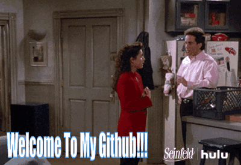

<h1 style="text-align: center;">About Me</h1>

Hi there! I'm Mujahed Ali, a full stack developer hailing from the vibrant city of New York. With a solid educational background, having graduated from App Academy, I'm deeply passionate about crafting exceptional web experiences. Currently, I'm pouring my creativity and skills into building [ConnectIn](https://www.connectin.mujahedali.com/), a dynamic web application aimed at revolutionizing professional networking.

 

Beyond coding, I'm a huge fan of sitcoms, especially those from the late '90s and early 2000s era. You'll often find me immersed in the witty banter of shows like Seinfeld, Boy Meets World, or How I Met Your Mother. As a self-professed TV and movie junkie, I'm always on the lookout for captivating storytelling and memorable characters. Feel free to share any TV shows and movies that you recommend—I'm always open to discovering new favorites!

 
 
 
 
 
 

<h1 style="text-align: center;">Skills</h1>
 
### Languages

### FrontEnd

### Backend

### Database

### Hosting 

### Tools/Librariies

